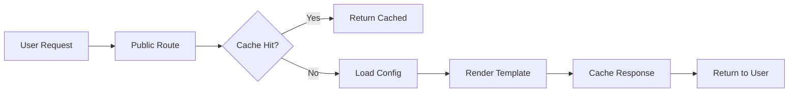
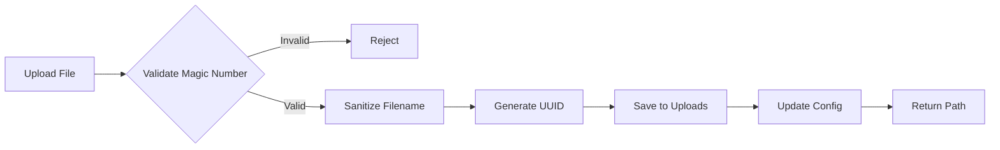

# WICARA CMS - Technical Architecture

**Version**: 1.0.0
**Last Updated**: 2026-01-09

## Table of Contents
- [System Overview](#system-overview)
- [Architecture Principles](#architecture-principles)
- [Directory Structure](#directory-structure)
- [Component Architecture](#component-architecture)
- [Data Flow](#data-flow)
- [Technology Stack](#technology-stack)
- [Design Patterns](#design-patterns)

---

## System Overview

WICARA CMS is a flat-file Content Management System built with Flask that allows creating editable static websites without a database. All content is stored in a single `config.json` file, making it portable and easy to backup.

### Key Characteristics
- **Flat-file**: No database required
- **Portable**: Single config.json file contains all content
- **Modular**: Clean separation of concerns with blueprints
- **Performant**: Multi-layer caching (50-80% performance improvement)
- **Extensible**: Plugin system for custom functionality

---

## Architecture Principles

### 1. Separation of Concerns
- **Engine** (`app/`): Core CMS functionality, admin panel
- **Content** (`sites/`): User content, templates, static files
- Clear boundaries between engine and user data

### 2. Modularity
- **Blueprints**: Routes organized by feature (auth, admin, public)
- **Core Modules**: Reusable business logic (config, file, template managers)
- **Cache System**: Pluggable cache backends (memory, file, Redis)

### 3. Application Factory Pattern
- `create_app()` function for Flask app initialization
- Environment-based configuration (dev, prod, test)
- Easy testing and multiple instances

### 4. Convention over Configuration
- Default template locations
- Automatic field type detection
- Minimal configuration required

---

## Directory Structure

```
wicara/
├── app/                          # Engine Code
│   ├── __init__.py               # Application factory
│   ├── config.py                 # Environment configuration
│   ├── logger.py                 # Logging setup
│   ├── errors.py                 # Error handlers
│   ├── utils.py                  # Utility functions
│   │
│   ├── modules/                  # Feature Modules (Blueprints)
│   │   ├── auth/                 # Authentication (login/logout)
│   │   ├── admin/                # Admin panel functionality
│   │   ├── public/               # Public-facing pages
│   │   ├── import_export/        # Import/Export system
│   │   └── cli/                  # Command-line interface
│   │
│   ├── core/                     # Core Business Logic
│   │   ├── config_manager.py     # Configuration CRUD
│   │   ├── file_manager.py       # File operations & uploads
│   │   ├── template_manager.py   # Template rendering
│   │   └── validators.py         # Input validation
│   │
│   ├── cache/                    # Caching System
│   │   ├── manager.py            # Cache abstraction
│   │   ├── backends.py           # Cache implementations
│   │   ├── config_cache.py       # Config caching
│   │   ├── template_cache.py     # Template caching
│   │   └── response_cache.py     # HTTP response caching
│   │
│   └── templates/                # ADMIN TEMPLATES ONLY
│       └── admin/
│
├── static/                       # ENGINE STATIC FILES ONLY
│   ├── css/
│   │   └── admin.css
│   └── js/
│       └── admin.js
│
├── sites/                        # USER CONTENT (Multi-site ready)
│   ├── default/                  # Default site
│   │   ├── config.json           # Site configuration
│   │   ├── templates/            # User templates
│   │   │   ├── base.html
│   │   │   ├── home.html
│   │   │   └── ...
│   │   └── static/               # User static files
│   │       ├── css/
│   │       ├── js/
│   │       └── images/
│   │           └── uploads/
│   │
│   └── site2/                    # Additional sites
│       ├── config.json
│       ├── templates/
│       └── static/
│
├── scripts/                      # Utility scripts
│   └── migrate_to_sites.py
│
├── run.py                        # Application entry point
├── requirements.txt              # Python dependencies
├── .env.example                  # Environment variables template
└── config.json                   # Legacy config (use sites/default/config.json)
```

---

## Component Architecture

### Application Factory (`app/__init__.py`)

```python
def create_app(config=None):
    # 1. Create Flask app with template/static paths
    # 2. Load configuration
    # 3. Setup logging
    # 4. Initialize cache system
    # 5. Register blueprints
    # 6. Register error handlers
    # 7. Initialize site manager
    return app
```

### Core Modules

#### ConfigManager (`app/core/config_manager.py`)
- Load/save `config.json` with validation
- Automatic backup creation
- File modification time tracking for cache invalidation
- Schema validation with detailed error messages

#### FileManager (`app/core/file_manager.py`)
- Image upload with security validation
  - Magic number verification (not just extensions)
  - 5MB file size limit
  - Secure filename sanitization with UUIDs
- Delete images from filesystem
- Cleanup unused image references

#### TemplateManager (`app/core/template_manager.py`)
- Render Jinja2 templates with context
- Convert hyphenated keys to underscores
  - `"hero-title"` in config → `{{hero_title}}` in template
- Prepare template context with global variables

#### Validators (`app/core/validators.py`)
- Field validation: text (255 chars), textarea (5000 chars)
- Image file validation with magic number checking
- Configuration schema validation
- Page schema validation

### Cache System (Phase 2)

#### CacheManager (`app/cache/manager.py`)
- Unified abstraction for multiple backends
- Statistics tracking (hits, misses, errors)
- Health monitoring and error recovery

#### Cache Types
- **ConfigCache**: Parsed JSON config caching (5min TTL)
- **TemplateCache**: Template fragment caching (1hr TTL)
- **ResponseCache**: HTTP response caching with ETags (1hr TTL)

#### Cache Backends
- **MemoryCache**: Fastest, default for development
- **FileCache**: Persistent, suitable for small deployments
- **RedisCache**: Distributed caching for production

### Blueprint Modules

#### Auth Module (`app/modules/auth/`)
- `/admin/login` - Admin login form
- `/admin/logout` - Admin logout
- Session management with 1-hour timeout
- Password hashing with Werkzeug scrypt

#### Admin Module (`app/modules/admin/`)
- `/admin/` - Dashboard (page listing)
- `/admin/edit/<index>` - Page content editor
- `/admin/settings` - Global site settings
- `/admin/change-password` - Password change form
- `/admin/cleanup` - Cleanup unused images

#### Public Module (`app/modules/public/`)
- `/` - Home page
- `/<path:url>` - Dynamic page handler
- Template rendering with cache support

#### Import/Export Module (`app/blueprints/import_export.py`)
- `/admin/import-export/export` - Export wizard
- `/admin/import-export/import` - Import wizard
- `/admin/import-export/import/preview` - Preview import
- Multi-step wizards with progress tracking

#### CLI Module (`app/modules/cli/commands.py`)
- `create-page` - Create new page
- `list-pages` - List all pages
- `delete-page` - Delete page
- `help` - Show help

---

## Data Flow

### Request Flow (Public Page)



### Config Update Flow


### File Upload Flow



---

## Technology Stack

### Backend
- **Framework**: Flask 3.x
- **Python**: 3.9+
- **Templating**: Jinja2
- **Security**: Werkzeug (password hashing)

### Frontend
- **CSS**: Bootstrap 5
- **JavaScript**: Vanilla JS
- **Icons**: Bootstrap Icons

### Development
- **Entry Point**: `run.py` with `.env` support
- **Environment Configuration**: `app/config.py`
- **Logging**: Structured logging with file rotation
- **Testing**: (TBD)

### Optional
- **Cache Backends**: Redis (optional)
- **Web Server**: Gunicorn (production)
- **Reverse Proxy**: Nginx (production)

---

## Design Patterns

### 1. Application Factory Pattern
```python
# app/__init__.py
def create_app(config=None):
    app = Flask(__name__)
    # ... initialization
    return app
```

### 2. Blueprint Pattern
```python
# app/modules/admin/routes.py
admin_bp = Blueprint('admin', __name__, url_prefix='/admin')

@admin_bp.route('/')
def dashboard():
    # ...
```

### 3. Strategy Pattern (Cache Backends)
```python
# app/cache/backends.py
class CacheBackend(ABC):
    @abstractmethod
    def get(self, key): pass

    @abstractmethod
    def set(self, key, value): pass

class MemoryCache(CacheBackend): ...
class FileCache(CacheBackend): ...
class RedisCache(CacheBackend): ...
```

### 4. Repository Pattern (Config Manager)
```python
# app/core/config_manager.py
class ConfigManager:
    def load(self): ...
    def save(self, config): ...
    def get(self, *keys): ...
```

### 5. Template Method Pattern
```python
# app/cache/manager.py
class CacheManager:
    def get(self, key):
        # Template method with hooks
        self.before_get(key)
        result = self.backend.get(key)
        self.after_get(key, result)
        return result
```

---

## Configuration System

### Environment Variables
```bash
# Flask
FLASK_ENV=development|production
SECRET_KEY=<your-secret-key>
HOST=localhost
PORT=5555

# Content
SITES_DIR=sites
DEFAULT_SITE=default
LEGACY_MODE=false

# Cache
CACHE_BACKEND=memory|file|redis
CONFIG_CACHE_TTL=300
TEMPLATE_CACHE_TTL=3600
RESPONSE_CACHE_TTL=3600

# Logging
LOG_LEVEL=INFO|DEBUG|WARNING|ERROR
LOG_FILE=logs/wicara.log
```

### Config.json Structure
```json
{
  "admin-password": "hashed-password",
  "sitename": "Website Name",
  "description": "Site description",
  "keywords": ["keyword1", "keyword2"],
  "pages": [
    {
      "title": "Page Title",
      "template": "template.html",
      "url": "/page-url",
      "menu-title": "Menu Label",
      "seo-description": "SEO description",
      "seo-keywords": ["seo", "keywords"],
      "fields": [
        {
          "name": "field-name",
          "type": "text|textarea|image",
          "label": "Field Label",
          "value": "field-value"
        }
      ]
    }
  ],
  "footer": {
    "content": ["Footer line 1", "Footer line 2"]
  }
}
```

---

## Security Features

1. **Password Hashing**: Werkzeug scrypt method
2. **Session Management**: 1-hour timeout, secure cookies (HTTPONLY, SAMESITE=Lax)
3. **File Upload Validation**:
   - Magic number verification
   - 5MB size limit
   - Secure filename with UUIDs
4. **CSRF Protection**: Flask session-based tokens
5. **Input Validation**: Length limits and HTML sanitization
6. **Error Handling**: Detailed logging without exposing sensitive info

---

## Performance Optimizations

### Caching Strategy
- **Config Cache**: 95% reduction in JSON parsing overhead
- **Template Cache**: Fragment-level caching with dependency tracking
- **Response Cache**: ETag-based conditional requests
- **Cache Warming**: Pre-load frequently accessed content

### File System
- Lazy loading of templates
- Efficient file cleanup operations
- Backup rotation (max 10 backups)

---

## Extension Points

### Plugin System (Phase 4)
- Custom field types
- Admin page extensions
- Template filters
- CLI commands
- Cache providers

### Multi-Site Support (Phase 5)
- Per-site configurations
- Site isolation
- Domain-based routing
- Cross-site resource sharing

---

## Deployment Considerations

### Production Checklist
- [ ] Set strong `SECRET_KEY`
- [ ] Enable HTTPS
- [ ] Use production config
- [ ] Configure Redis cache (optional)
- [ ] Set up log rotation
- [ ] Configure Gunicorn
- [ ] Set up Nginx reverse proxy
- [ ] Enable file permissions for config.json
- [ ] Configure backup strategy

### Monitoring
- Cache statistics dashboard (`/admin/cache/`)
- Error logging
- Performance metrics
- Resource usage tracking

---

## References

- **SRS**: [docs/wicara-srs.md](docs/wicara-srs.md)
- **Vision**: [docs/wicara-vision.md](docs/wicara-vision.md)
- **Backlog**: [docs/BACKLOG.md](docs/BACKLOG.md)
- **Setup Guide**: [docs/SETUP_GUIDE.md](docs/SETUP_GUIDE.md)
- **Developer Guide**: [docs/DEVELOPER_GUIDE.md](docs/DEVELOPER_GUIDE.md)
